

<!-- logo -->

### DEVLENS Readme✅

  
  

 

## 📝 프로젝트 소개
웹에이전시 내에서 계약 단계부터 납품 및 하자보수까지의 과정을 클라이언트와 효율적으로 공유 및 관리할 수 있는 웹 서비스입니다.

### Devlens는!

- **프로젝트별 소통 게시판**을 통해 고객사와 개발사가 하나의 플랫폼에서 원활하게 협업할 수 있습니다.
- **커스터마이징 단계 관리** 기능으로 프로젝트 특성에 맞게 단계를 설정하고 직관적으로 진행 상황을 확인할 수 있습니다.
- **결재 시스템 기반 체크리스트**를 통해 승인/거절 결재 시스템을 도입하여 프로젝트를 체계적으로 관리할 수 있습니다.
- **권한별 접근 시스템**을 통해 지정된 프로젝트에만 접근하도록 제한하여 보안성과 관리 효율을 강화할 수 있습니다.
 

Q. 잠깐! 고객사, 개발사, 관리자가 무엇을 의미하나요?
> 고객사 : 프로젝트 요청 및 진행 상황 확인, 결재 및 승인 관리를 할 수 있습니다.  
> 개발사 : 프로젝트 진행 및 협업, 승인 요청, 업무 상태 업데이트를 진행합니다.  
> 관리자 : 전체 시스템 및 사용자 관리, 프로젝트 진행 모니터링을 합니다.

🪄 [devlens 서비스 이용하기](https://www.devlens.work/)
 

### 화면 구성
|                 사용자 화면 #1 - 메인 대시보드                 |                사용자 화면 #2 - 프로젝트 진행 단계                 |
|:---------------------------------------------------:|:-----------------------------------------------------:|
|   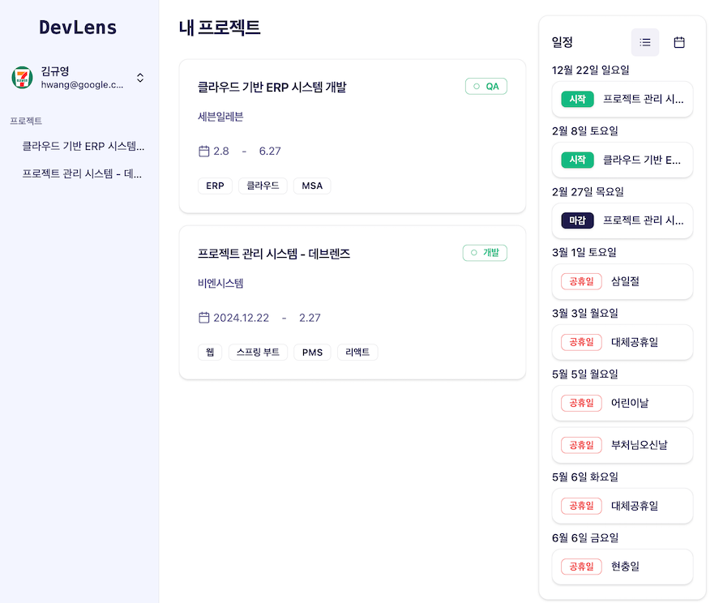   |  |
|                사용자 화면 #3 - 체크리스트 내역                 |                사용자 화면 #4 - 체크리스트 반려 시                 |
|   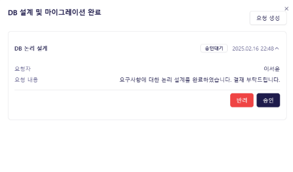    |    |
|                사용자 화면 #3 - 프로젝트 게시판                 |                  사용자 화면 #4 - 게시글 상세                   |
|  |      |
|                   관리자 화면 #1 -대시보드                   |                 관리자 화면 #2 - 회사 생성 페이지                 |
| 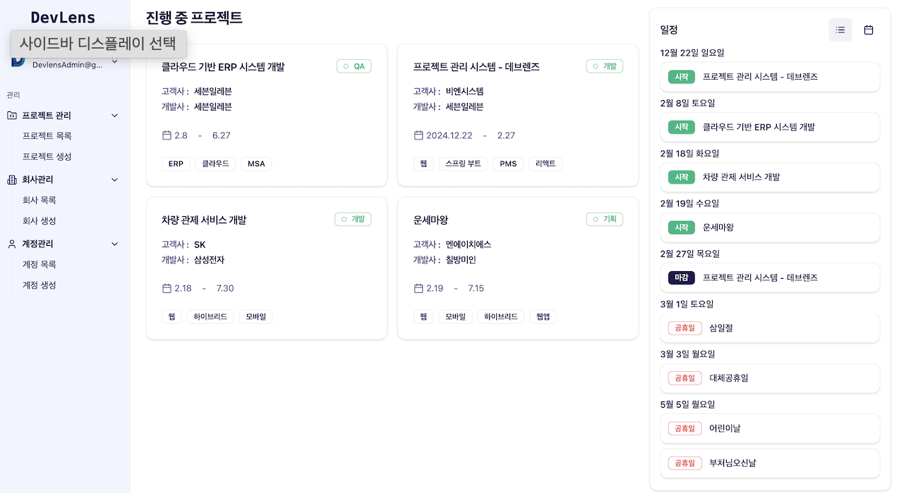 |    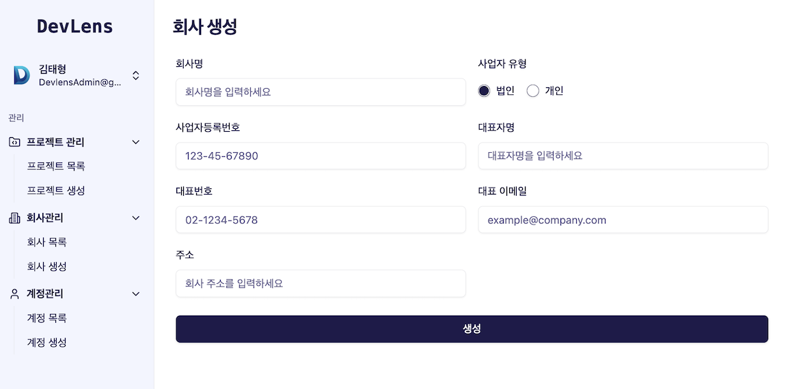    |
|               관리자 화면 #3 - 프로젝트 생성 페이지               |                관리자 화면 #4 - 권한 부여 페이지                |
|   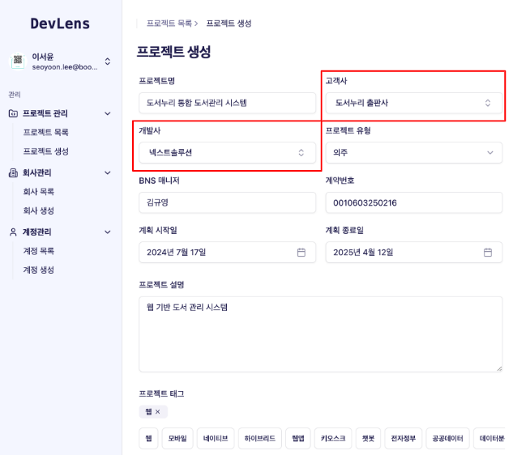    |    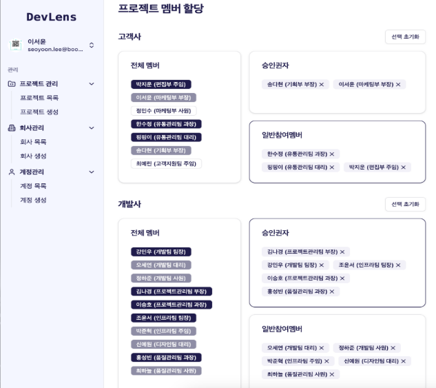     |

 

## 📍 주요 기능

### <대시보드>
  1. 참여한 모든 프로젝트 목록 조회
     - 프로젝트 참여자로 지정된 프로젝트만 조회가 가능합니다.
     - 소속 회사의 프로젝트 목록을 조회할 수 있습니다.
  2. 프로젝트 기본 정보 조회
     - 프로젝트 기본 정보(프로젝트명, 개발사명, 프로젝트 기간)가 표시됩니다.
     - 프로젝트 진행 상태 태그를 통해 현재 진행 현황을 알 수 있습니다.

### <프로젝트>
  1. 프로젝트 진행 단계 커스터마이징
     - 프로젝트 생성 시 5개의 기본 진행 단계가 제공됩니다.
     - 진행 단계는 프로젝트 특성에 맞게 명칭 및 순서를 변경할 수 있습니다.
  2. 참여자별 접근 권한
     - 참여자는 부여받은 권한에 따라 기능을 수행할 수 있습니다.
     - 참여자는 승인권자와 일반참여자로 구분됩니다.
     > 승인권자의 권한 : 승인 요청, 체크리스트 추가(개발사), 승인 및 반려(고객사)  
       참여자의 권한 : 단계 및 체크리스트 내용 확인, 단계별 게시판 작성
  
### <체크리스트>
  1. 체크리스트
     - 각 단계별 체크리스트 개수를 확인할 수 있습니다.
     - 개발사는 체크리스트 제목과 승인요청 버튼이 보입니다.
     - 고객사는 체크리스트 제목과 승인/반려 버튼이 보입니다.
  2. 단계별 체크리스트 생성
       - 프로젝트 단계별 중요한 필수 작업을 체크리스트로 지정할 수 있습니다.
       - 체크리스트는 개발사 승인권자만 추가할 수 있습니다.
  3. 체크리스트 승인 요청
       - 개발사의 승인권자는 필수 작업을 완료 후, 고객사에게 승인 요청을 할 수 있습니다.
       - 승인 요청 시, 문서 번호를 참조하여 요청할 수 있습니다.
  4. 체크리스트 승인 및 반려
     - 고객사의 승인권자는 개발사의 승인 요청을 확인한 후, 승인 및 반려 처리할 수 있습니다.
     - 반려 시, 반려 사유 입력이 가능합니다.
  5. 체크리스트 결재 내역 조회
     - 체크리스트와 관련된 모든 결재 프로세스는 내역을 조회할 수 있습니다.
     > 결재 프로세스 : 개발사의 승인 요청 > 고객사의 승인 및 반려  
       내역 : 요청자, 요청일시, 요청내용, 처리자, 처리일시, 반려사유

### <게시판>
  1. 게시판 조회
     - 모든 단계의 게시글을 조회할 수 있는 전체 게시판과 단계별 게시판으로 구분됩니다.
     - 계층형 구조의 게시판으로, 원글에 대한 답글 작성이 가능합니다.
     - 게시글 목록 조회 시, 답글이 존재하는 경우 원글과 답글이 함께 조회됩니다.
     - 게시글 목록은 글 제목, 작성자, 작성일, 우선순위, 처리 상태, 마감일, 댓글 수를 확인할 수 있습니다.
  2. 게시글 검색
     - 게시글은 제목, 내용, 작성자 필터를 통해 검색할 수 있습니다.
     - 게시글 검색 시 시간순 정렬을 통해 편리하게 조회할 수 있습니다.
  3. 게시글 생성
     - 게시글 작성 시, 단계를 지정할 수 있습니다.
     - 필수 항목에는 제목, 본문이 있으며, 추가로 첨부파일과 링크를 각 10개씩 첨부할 수 있습니다.
     - 게시글의 작업 상태, 우선순위, 마감일을 옵션으로 입력할 수 있습니다.
  4. 게시글 조회
     - 원글 조회 시, 답글 목록 및 개수를 조회할 수 있고 제목을 클릭하여 답글 상세 페이지로 이동할 수 있습니다.
     - 답글 조회 시, 원글 제목이 조회되며 제목을 클릭하여 원글 상세 페이지로 이동할 수 있습니다.

### <파일 관리>
  1. 프로젝트 관련 파일 S3 저장 및 관리
     - 사용자 프로필, 기업 로고, 게시글 첨부 파일 등의 프로젝트 관련 파일을 저장 및 관리합니다.
     - 모든 파일은 S3에 업로드된 후, 해당 파일의 메타데이터를 DB에 기록하여 체계적으로 관리합니다.
  2. 파일 이력 관리
     - 파일 등록과 삭제시, 해당 작업에 대한 이력을 DB에 저장합니다.
     - 파일이 삭제되더라도 S3버킷에서는 물리적으로 삭제되지 않으며, 이를 통해 백업 및 감사 목적으로 활용할 수 있습니다.

### <링크 관리>
  1. 프로젝트 관련 링크 저장 및 관리
     - 게시물에 업로드한 링크들을 DB에 개별적으로 저장하여 체계적으로 관리합니다.
     - 향후 결재 시스템과 연관된 링크 관리 기능 추가 예정.
  2. 링크 이력 관리
     - 링크 등록 및 삭제시, 해당 이력을 DB에 저장하여 추적이 가능하도록 합니다.
     - 링크 삭제 시, 링크 삭제 이력이 저장되어 추후 백업 및 감사 과정에 활용할 수 있습니다.

### <백오피스>
####  [회사 관리]
  1. 회사 목록 조회
     - 회사 목록에는 회사명, 대표자명, 대표자 연락처, 대표자 이메일, 주소, 사업자 구분, 사업자 등록 번호, 상태를 확인할 수 있습니다.
     - 회사를 클릭하면 회사 상세 페이지로 이동할 수 있습니다.
  2. 회사 생성
     - 회사 생성 시, 회사명, 사업자 유형, 사업자 번호, 대표자명, 대표번호, 대표 이메일, 주소를 입력할 수 있습니다.
  3. 회사 수정
     - 회사 상세 페이지에서 수정 버튼을 누르면 회사 정보를 수정할 수 있습니다.
     - 회사의 활성화 상태를 비활성화로 변경하면 회사에 종속된 회원의 상태도 비활성화로 변경 됩니다.
#### [회원 관리]
  1. 회원 목록 조회
     - 회원 목록에는 아이디, 이름, 이메일, 연락처, 권한, 상태, 생년월일을 확인할 수 있습니다.
     - 회원을 클릭하면 회원 상세 페이지로 이동할 수 있습니다.
  2. 회원 생성
     - 회원 계정을 생성 시, 소속회사가 반드시 존재해야 합니다.
     - 회원 생성 시, 이름, 아이디, 비밀번호, 전화번호, 이메일, 권한, 소속회사는 필수 값이며, 생년월일, 부서/직책 옵션값으로 입력할 수 있습니다.
     - 엑셀(CSV) 파일을 이용해 계정 일괄 생성이 가능합니다.
  3. 회원 수정 및 삭제
     - 회원 상세 페이지에서 수정 버튼을 누르면 아이디를 제외한 모든 회원 정보를 수정할 수 있습니다.
     - 삭제 버튼 클릭 시, 회원의 상태는 비활성화로 변경됩니다.
#### [프로젝트 관리]
  1. 프로젝트 목록 조회
     - 프로젝트 목록에는 프로젝트 명, 고객사, 개발사, 프로젝트 유형, 상태, 담당자, 시작일과 종료일을 확인할 수 있습니다.
     - 프로젝트 클릭 시, 프로젝트 상세 페이지로 이동할 수 있습니다.
  2. 프로젝트 생성
     - 프로젝트 생성 시, 프로젝트 기본 정보(프로젝트명, 고객사, 개발사, 프로젝트 유형, 계획일, 프로젝트 설명, 태크 등)을 입력할 수 있습니다.
     - 고객사와 개발사 각각의 참여 인원과 접근 권한(승인권자, 일반참여자)을 지정할 수 있습니다. 
  3. 프로젝트 수정
     - 프로젝트 상세 페이지에서 수정 버튼 클릭 시, 고객사와 개발사를 제외한 모든 프로젝트 정보를 수정할 수 있습니다.

 

## ⚙ 기술 스택

### Front-end

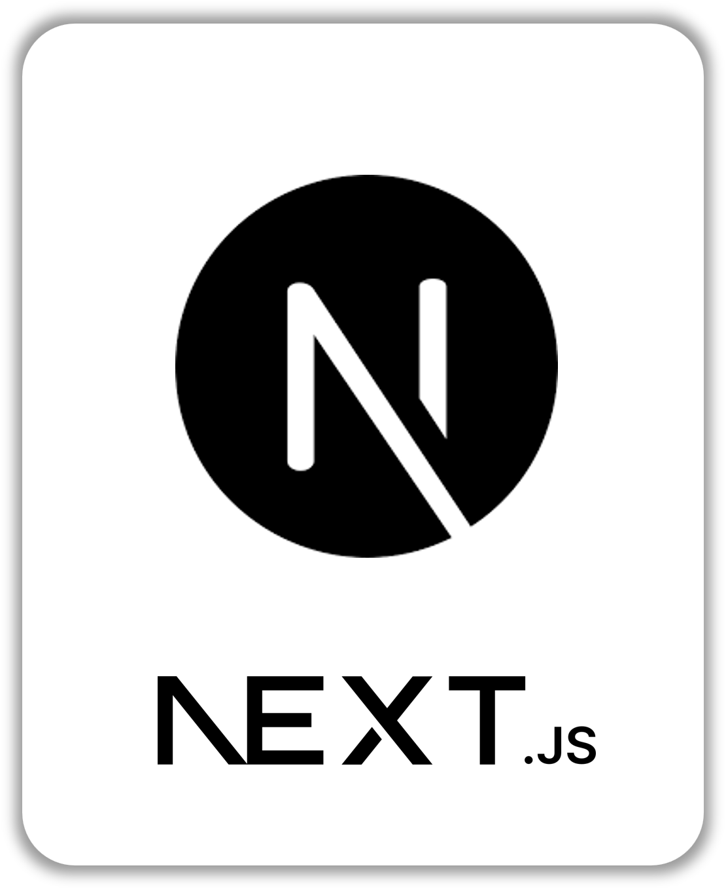
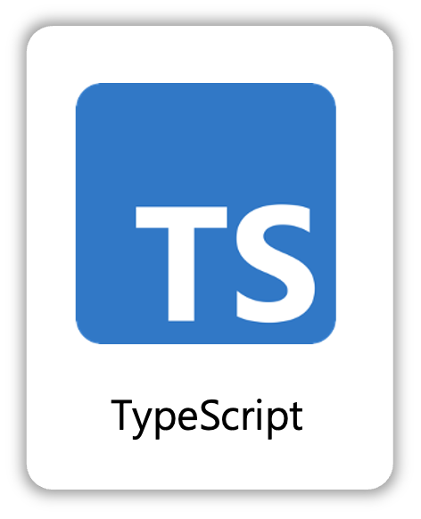
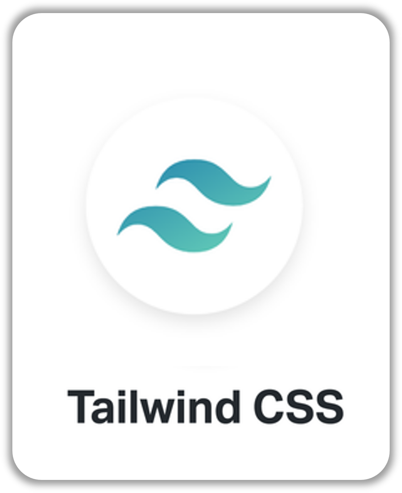
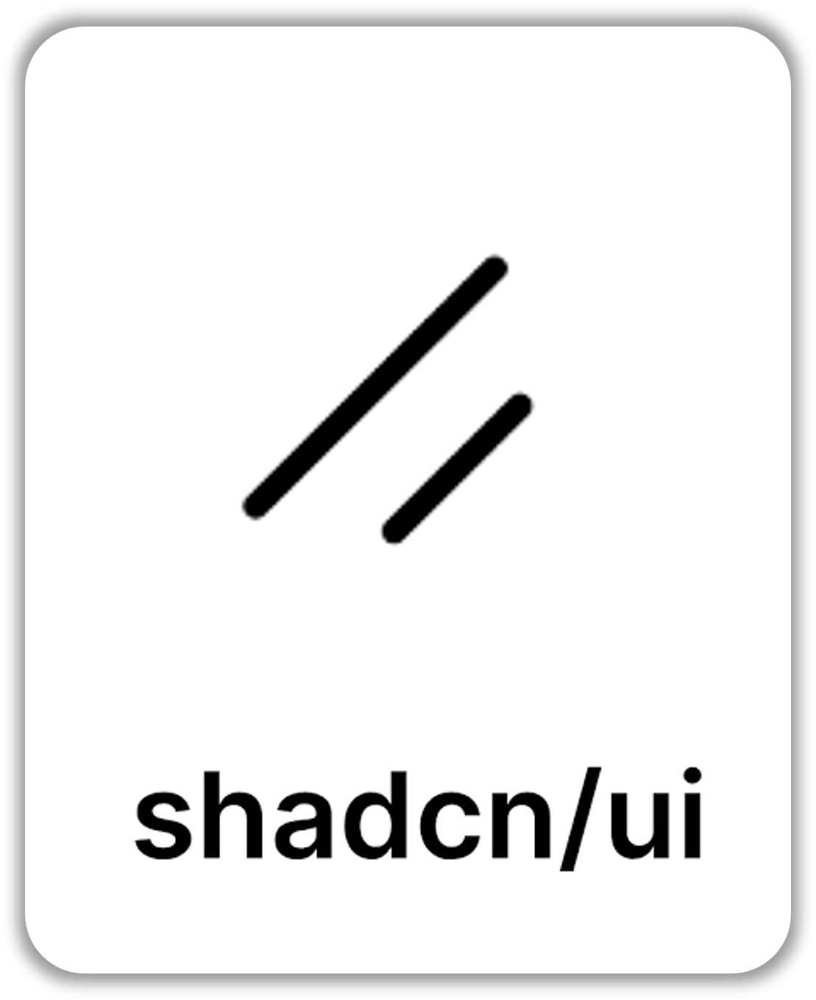
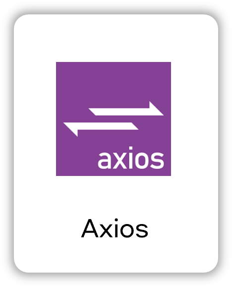

### Back-end

### Infra

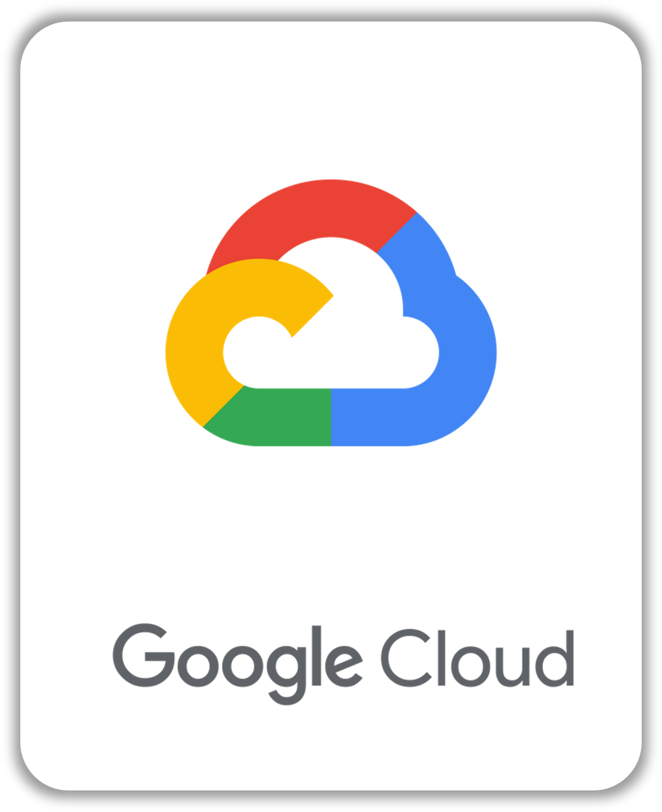

### Tools

 

## 🛠️ 프로젝트 아키텍쳐

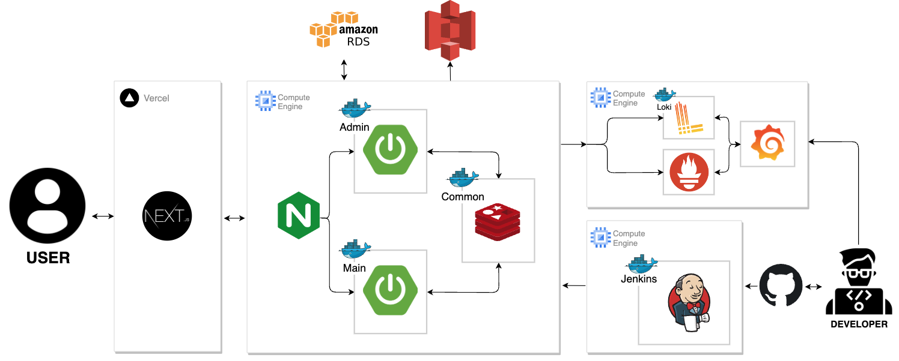

 
 

## 🗂️ 기술 문서

👉 **API 명세서** : [바로가기](https://docs.google.com/spreadsheets/d/1PqEn59XP4E7UgQDv9gJ4ZIOBvHWXN_rnXk-Hsugjvgo/edit?gid=1624724435#gid=1624724435)

👉 **기능 명세서** : [바로가기](https://www.notion.so/9dba38c13b88444787a0cae943774bcb?pvs=4)

👉 **와이어 프레임** : [바로가기](https://www.notion.so/cd16a7f6e96748bb822904003268a8f3?pvs=4)

👉 **ERD** : [바로가기](https://www.erdcloud.com/d/rfhQYKgkJPTrXL3Ch)

 

## 💁‍♂️ 프로젝트 팀원

|             [팀장] Backend              |              Frontend               |               Backend               |               Backend               |               Backend               |               Backend               |               Backend               |
|:-------------------------------------:|:-----------------------------------:|:-----------------------------------:|:-----------------------------------:|:-----------------------------------:|:-----------------------------------:|:-----------------------------------:|
| [윤정아](https://github.com/jeongns2611) | [심정아](https://github.com/joanShim) | [김규영](https://github.com/K-KY) | [김대현](https://github.com/kdh10806) | [권택민](https://github.com/taekminKwon) | [이승열](https://github.com/Eseas) | [오승민](https://github.com/HiSeungmin) |
|           팀 총괄, 게시판, 댓글 개발            |              프론트 전반 개발              |       CI/CD 파이프라인 구축 및 인프라       |          파일 및 링크 관리 API 개발          |           백오피스 회사 API 개발            |           프로젝트 API 개발            |          인증/인가, 회원 API 개발           |

> [팀 노션 바로가기](https://www.notion.so/SevenEleven-d7efd6c0c4464ceda4f906916499127f)